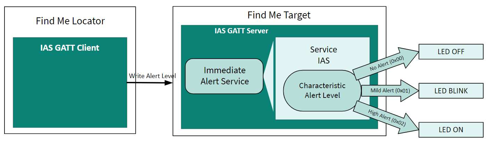
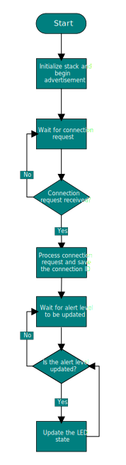

[Click here](../README.md) to view the README.

## Design and implementation

The design of this application is minimalistic to get started with code examples on PSOC&trade; Edge MCU devices. All PSOC&trade; Edge E84 MCU applications have a dual-CPU three-project structure to develop code for the CM33 and CM55 cores. The CM33 core has two separate projects for the secure processing environment (SPE) and non-secure processing environment (NSPE). A project folder consists of various subfolders, each denoting a specific aspect of the project. The three project folders are as follows:

**Table 1. Application projects**

Project | Description
--------|------------------------
*proj_cm33_s* | Project for CM33 secure processing environment (SPE)
*proj_cm33_ns* | Project for CM33 non-secure processing environment (NSPE)
*proj_cm55* | CM55 project

 

In this code example, at device reset, the secure boot process starts from the ROM boot with the secure enclave (SE) as the root of trust (RoT). From the secure enclave, the boot flow is passed on to the system CPU subsystem where the secure CM33 application starts. After all necessary secure configurations, the flow is passed on to the non-secure CM33 application. Resource initialization for this example is performed by this CM33 non-secure project. It configures the system clocks, pins, clock to peripheral connections, and other platform resources. It then enables the CM55 core using the `Cy_SysEnableCM55()` function and the CM55 core is subsequently put to DeepSleep mode.

In the CM33 non-secure application, the clocks and system resources are initialized by the BSP initialization function. The retarget-io middleware is configured to use the debug UART. BTSTACK is initialized and callback functions are registered. Events handlers are written to handle the BTSTACK callback events. CYBSP_USER_LED1 and CYBSP_USER_LED2 are initialized, and PWM is used to control the LEDs.

The 'Find Me Locator' (the Bluetooth&reg; LE Central device) is a Bluetooth&reg; LE GATT Client. The 'Find Me Target' (the Peripheral device) is a Bluetooth&reg; LE GATT Server with the IAS implemented, as **Figure 1** shows.

**Figure 1. Find Me Profile (FMP) implementation**

The Bluetooth&reg; LE Find Me Profile defines what happens when the central device broadcasts a change in the alert level.

The Find Me Locator performs service discovery using the "GATT Discover All Primary Services" procedure. The Bluetooth&reg; LE service characteristic discovery is done by the "Discover All Characteristics of a Service" procedure. When the Find Me Locator wants to cause an alert on the Find Me Target, it writes an alert level in the Alert Level characteristic of the IAS. When the Find Me Target receives an alert level, it indicates the level using the CYBSP_USER_LED1: OFF for no alert, blinking for mild alert, and ON for high alert.

**Figure 2. Find Me Profile (FMP) process flowchart**

 